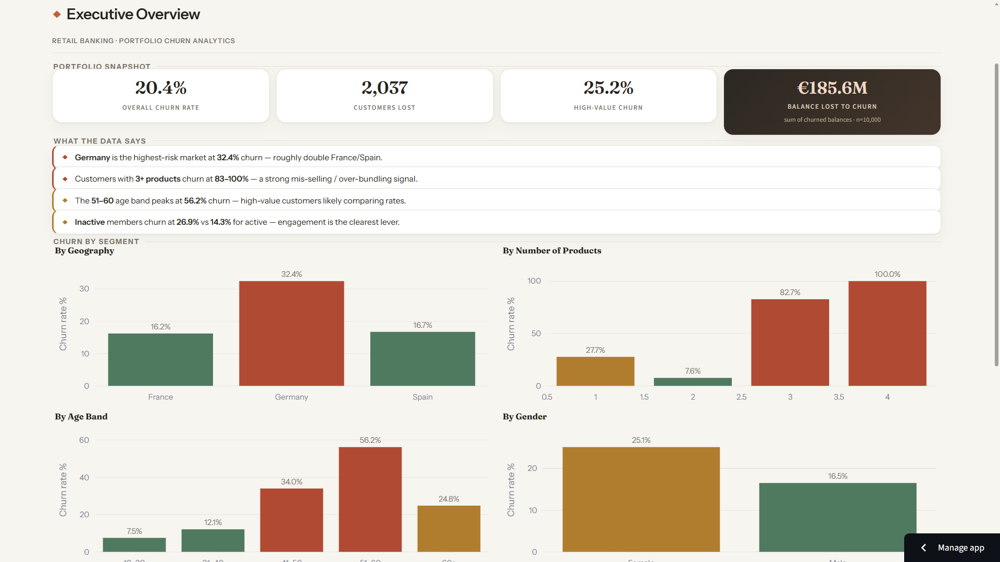
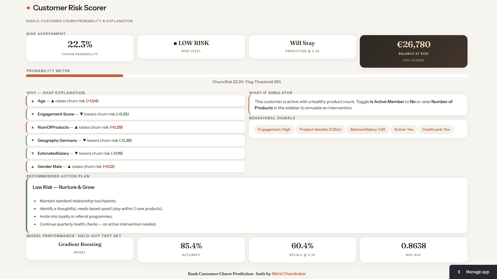
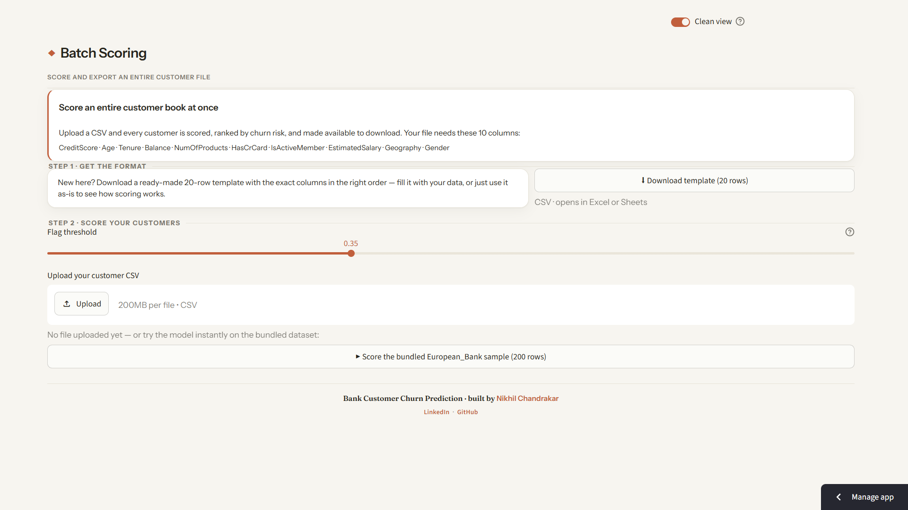

# Bank Customer Churn Prediction


**A tool that tells a bank which customers are about to leave — and what to do about it.**

When a customer closes their account, the bank loses their deposits and future business. This app predicts how likely a customer is to leave, explains why, and suggests how to keep them — for one customer or for thousands at once. Built on data from 10,000 European bank customers.

👉 Try the [live app.](https://bank-customer-churn-prediction-ml-nikchansocial.streamlit.app/)

---

## The three screens

**Overview** — the big picture: how many customers are leaving, how much money is at stake, and which groups are most at risk.



**Risk Scorer** — enter one customer's details to see their chance of leaving, the main reasons, and a suggested action plan.



**Batch Scoring** — upload a customer list and the tool scores everyone, ranks them by risk, and lets you download the results.



---

## What the data revealed

- **Germany is the biggest problem market** — about 1 in 3 customers leave, double the rate in France or Spain.
- **Customers sold 3+ products leave at very high rates (83–100%)** — a sign of over-selling that backfires.
- **Inactive customers leave nearly twice as often as active ones** — engagement is the biggest lever.
- **Middle-aged customers (51–60) are the most likely to leave (~56%).**

## How good is it?

Tested on 2,000 unseen customers, the tool correctly sorts who's likely to leave vs. stay about **86% of the time**, and flags **60%** of actual leavers in advance. It's tuned to catch as many leavers as possible, since missing one costs more than a false alarm.

---

## Run it yourself

No install needed — just open the [live app](https://bank-customer-churn-prediction-ml-nikchansocial.streamlit.app/). To run locally:
```bash
git clone https://github.com/nikchansocial/bank-customer-churn-prediction-ml.git
cd bank-customer-churn-prediction-ml
pip install -r requirements.txt
streamlit run app/app.py
```

<details>
<summary><b>Technical details</b></summary>

- **Model:** Gradient Boosting Classifier (scikit-learn) with engineered features (balance-to-salary ratio, age x tenure, product density, engagement score).
- **Explainability:** SHAP shows which factors drove each individual prediction.
- **Results (held-out test set, n = 2,000):** ROC-AUC 0.864 · Accuracy 85.4% · Recall 60.4% · Precision 65.1% at a 0.35 threshold (tuned to favour recall).
- **Engineering:** one shared feature pipeline for training and prediction (no skew); metrics computed live, not hardcoded; model saved as `.joblib` and loaded at startup with a retrain fallback.
- **Stack:** Python, Streamlit, scikit-learn, SHAP, Plotly, pandas, joblib.
- **Layout:** `app/` (logic + screens) · `data/` · `models/` · `train.py` to re-train.

</details>

---

**Made By Nikhil Chandrakar**
   [LinkedIn](https://www.linkedin.com/in/nikchansocial) · [GitHub](https://github.com/nikchansocial)
